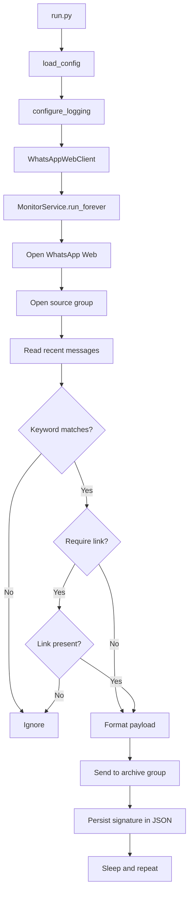

<div align="center">


# WhatsApp Internship Monitor

A personal **Python** project designed to **monitor specific WhatsApp Web groups**, detect messages containing keywords such as **"internship"**, and **automatically forward matching messages** to an archive group.


</div>

---

## Overview

This project automates a simple but highly practical workflow: it opens **WhatsApp Web**, enters **groups defined in the configuration**, scans **recent messages** for monitored **keywords**, and, whenever it finds a valid match, **forwards a structured summary** to an archive group.

The monitor also keeps a **local JSON state file** to avoid duplicates and reuses the **browser session** so you do not have to log in manually every time you run it.

### What it provides

- automatic opening of **WhatsApp Web**
- persistent Chrome session reuse through a saved **browser profile**
- cyclic monitoring of groups defined in `config.json`
- keyword matching with **accent normalization** and **case-insensitive** comparison
- optional filtering that requires a **link / email / URL** in the message
- formatted forwarding to an archive group
- local persistence of previously processed messages
- safe testing mode with **`dry_run`**

---

## Project stack

- **Python 3.10+**
- **Selenium 4.39+**
- **Google Chrome / ChromeDriver**
- **WhatsApp Web**
- **JSON** for lightweight configuration and persistence

---

## Architecture

The project follows a lean and maintainable structure, separating **configuration**, **domain**, **orchestration**, **infrastructure**, **persistence**, and **utility logic**.

### Main layers

- **Application entry point**
  - `run.py` starts the project, loads the configuration, and wires the dependencies.

- **Configuration**
  - `app/config.py` reads `config.json` and converts it into structured objects.

- **Domain / models**
  - `app/models.py` defines the dataclasses used by the system.

- **Orchestration**
  - `app/monitor_service.py` runs the main monitoring loop.

- **Infrastructure / web automation**
  - `app/whatsapp_client.py` interacts with the WhatsApp Web DOM through Selenium.

- **Lightweight persistence**
  - `app/state_store.py` stores processed message signatures in JSON.

- **Rules and utilities**
  - `app/keyword_matcher.py`, `app/formatter.py`, and `app/logging_setup.py` handle filtering, formatting, and logging.

---

## Execution flow



---

## Main project structure

```text
whatsapp_estagio_monitor/
├── app/
│   ├── __init__.py
│   ├── config.py
│   ├── formatter.py
│   ├── keyword_matcher.py
│   ├── logging_setup.py
│   ├── models.py
│   ├── monitor_service.py
│   ├── state_store.py
│   └── whatsapp_client.py
├── storage/
│   └── seen_messages.json
├── config.example.json
├── README.md
├── requirements.txt
└── run.py
```

---

## Requirements

- Python **3.10+**
- Google Chrome installed
- an active WhatsApp account already accessible through **WhatsApp Web**

---

## Installation

```bash
python -m venv .venv
source .venv/bin/activate
pip install -r requirements.txt
cp config.example.json config.json
```

---

## Configuration

The `config.example.json` file already includes a ready-to-adapt structure for this use case.

### Example

```json
{
  "browser": {
    "profile_dir": ".session/chrome",
    "headless": false,
    "wait_timeout_seconds": 30,
    "login_timeout_seconds": 240
  },
  "monitor": {
    "archive_group": "Arquivos",
    "source_groups": [
      "Vagas em TI estágio/Aprendizes",
      "InfoTech BR (Channels)",
      "IT NETWORKING 5"
    ],
    "keywords": ["estágio"],
    "poll_interval_seconds": 20,
    "lookback_messages": 30,
    "skip_own_messages": true,
    "dry_run": false,
    "state_file": "storage/seen_messages.json",
    "require_link": true
  }
}
```

---

## How to run

```bash
python run.py
```

### First run

1. Chrome will open.
2. Access **WhatsApp Web**.
3. Scan the QR code if necessary.
4. Wait until the main interface is fully loaded.
5. The monitor will start its cyclic scan.

---

## Safe testing mode

Before forwarding real messages, enable this mode in `config.json`:

```json
"dry_run": true
```

In this mode, the project only logs which messages **would** be forwarded, without actually sending them.

---

## How the filter works

The project normalizes the text before comparing keywords. In practice, this means the following are treated as equivalent:

- `Internship`
- `internship`
- `INTERNSHIP`
- words with equivalent normalized accents when applicable

If `require_link` is enabled, the message must also contain at least one of the following:

- `http://` or `https://`
- a `www.` link
- `mailto:`
- a recognizable email address

---

## Forwarded message format

```text
[Internship Monitor]
Source group: IT NETWORKING 5
Author: Person Name
When: 10:35, 03/06/2026
Message:
Original message content found in the group
```

---

## Operational best practices

- keep `dry_run` enabled before the first real execution
- confirm that group names in `config.json` are **exactly identical** to the names shown in WhatsApp
- do not commit `.session/`, `__pycache__/`, or temporary files
- keep Chrome and Selenium updated
- treat `app/whatsapp_client.py` as the main maintenance point, since it depends on the WhatsApp Web DOM

### Suggested `.gitignore`

```gitignore
.venv/
__pycache__/
*.pyc
.session/
storage/seen_messages.json
config.json
```

---

## Troubleshooting

### The bot cannot find a group

Check whether the name in `config.json` is **exactly the same** as the one displayed in WhatsApp Web.

### The bot opens WhatsApp but does not read messages

This usually indicates a change in the WhatsApp Web DOM. The first file to review is:

```text
app/whatsapp_client.py
```

### Unicode / emoji sending error

If ChromeDriver reports limitations with characters outside the BMP, sanitize the outgoing message text before calling `send_keys`.

### Invalid session or disconnected browser

If you see `InvalidSessionIdException`, the browser may have been closed or disconnected from DevTools. In that case, the client should recreate the session.

---

## Known limitations

- the automation depends on the current **WhatsApp Web** layout
- DOM changes may require XPath adjustments
- JSON persistence is lightweight and practical, but it is not a substitute for a database in larger scenarios
- this project was designed for **local and personal use**, not for mass messaging

---

## Security and ethics

This project was built for **personal use**, using your own WhatsApp Web session and groups that you already participate in. Use it carefully, at low volume, and responsibly.

---

## Author

**Miguel de Castilho Gengo**

Project developed for personal use, Selenium automation study, and organization of opportunities found on WhatsApp Web.
